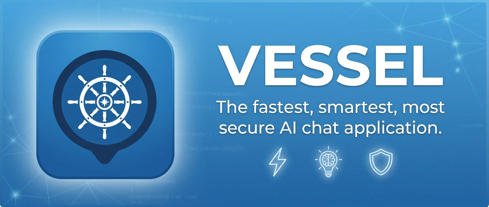

[](https://github.com/alexispurslane/vessel/actions/workflows/lint.yml)

## Philosophy

Vessel is built on a few core principles:

- **Extremely lightweight** — Svelte on the client, Svelte SSR for chat histories, Bun on the server, and careful attention to RAM and resource usage throughout. No heavy frameworks, no bloat.
- **Fault-tolerant and reliable** — All inference happens server-side, then SSE-streams to the client. If your connection dies mid-stream, Vessel backfills the client and resumes where it left off. If you're in a conversation from multiple devices, Vessel handles that seamlessly. Absolutely no messages are ever lost.
- **A safe realization of the agentic chat ideal** — Not just a chatbot, but a full agentic harness at its heart: any tools you expose, MCP servers you configure, all running inside per-conversation [zerobox](https://github.com/nicobailon/zerobox) sandboxes with configurable filesystem isolation, network allowlists, secrets management, and per-conversation overrides. The power of OpenClaw or the agentic features of claude.ai/gemini app — with real security.
- **Elegant, mobile-friendly UI** — Good typography, a design that gets out of your way, and full mobile support.
- **Agentic coding with rigorous linting** — Stretching the limits of linters (OxLint with security, JSDoc, and SonarJS plugins) to allow high-level agentic coding while keeping code well-documented, readable, well-factored, secure, type-safe, and free of common LLM pitfalls.

## Features

### Multi-Provider LLM Support

OpenAI, Anthropic, Google, Mistral, Groq, xAI, OpenRouter, Ollama, LM Studio, vLLM, and any OpenAI-compatible endpoint.

### Coding Agent

Powered by [pi-coding-agent](https://github.com/mariozechner/pi): bash execution, file read/write/edit, web fetch, and web search — all inside a [zerobox](https://github.com/nicobailon/zerobox) sandbox.

### Advanced Chat History Editing

Vessel offers the most flexible chat history editing of any AI chat app:

- **Regenerate** assistant messages
- **Regenerate with feedback** on the old message and/or a new model
- **Delete** any message
- **Edit** both user and assistant messages

All changes are represented as an **append-only directed acyclic graph** (DAG) — nothing is truly destroyed, and you can navigate the full branching history of a conversation using an actual flow graph.

### Conversation Forking

Any point in a conversation can be forked into a fresh, totally separate conversation with its own independent history.

### Deep Web Research Integration

Web search (any [Exa](https://exa.ai)-compatible API) and fetch are integrated directly into the Pi
agent harness via an extension — not just returning results to your AI, but keeping precise track of
what searches and fetches contributed to each message, and which are new for the given message
versus just part of the conversation history. This enables:

- **Per-message source lists** showing exactly what the agent searched for and what it fetched
- **Clickable sefarch sources** that show the precise search results the agent saw, and, if those results weren't just a list of links but included page contents too, allows you to click on a search result to read that page
- **Clickable fetched pages** that show the exact page content the agent saw, whether from a fetch or a search
- **A 3-pane research dashboard** — conversation to the left, search results list and page content on the other — so you can read both what your agent says about sources and the primary sources themselves

### Conversation Management

- Tags, pinning, archiving
- **Bulk operations** on conversations
- Export as Markdown, PDF, or **raw Pi JSONL**
- Resume Vessel sessions from regular [pi](https://github.com/mariozechner/pi) in the terminal by exporting the JSONL

### CodeMirror 6 Editor

Text inputs use [CodeMirror 6](https://codemirror.net/) with:

- Autocomplete for files uploaded to the agent's sandbox
- Full Emacs keybindings
- Markdown semi-WYSIWYG syntax highlighting

### More Features

- **MCP server support**: configure Model Context Protocol servers per-conversation for extended tooling
- **Authentication**: single-user setup with bcrypt password hashing and JWT sessions
- **Dark mode**: full dark/light theme support via [mode-watcher](https://mode-watcher.pages.dev/)
- **Keyboard-first**: comprehensive keyboard shortcuts for power users
- **Built-In Mermaid rendering**: Watch zoomable, pannable, explorable Mermaid diagrams be built live, on the fly, embedded in agent outputs. LaTeX also renders, and all tables can be downloaded as CSV

## Tech Stack

| Layer | Technology |
|---|---|
| Framework | [Svelte 5](https://svelte.dev/) (runes mode, SvelteKit) |
| Runtime | [Bun](https://bun.sh/) (including `bun:sqlite` for the database) |
| UI | [Shadcn](https://next.shadcn-svelte.com/) |
| AI Engine | [Pi](https://github.com/mariozechner/pi) (pi-coding-agent, pi-ai, pi-agent-core) |
| Sandbox | [Zerobox](https://github.com/nicobailon/zerobox) |
| Editor | [CodeMirror 6](https://codemirror.net/) |
| Linting | [OxLint](https://oxc.rs/docs/guide/usage/linter.html) (security, JSDoc, SonarJS plugins) |

## Getting Started

### Prerequisites

- [Bun](https://bun.sh/) ≥ 1.2

### Installation

```sh
git clone https://github.com/alexispurslane/vessel.git
cd vessel
bun install
```

### Development

```sh
bun run dev
```

The `dev` script uses `bun --bun vite dev` to run Vite with Bun's runtime instead of Node.js. This is required because Vessel uses `bun:sqlite` for its database.

### Production Build

Vessel's production build produces a **standalone self-contained binary** — the Bun runtime, all server code, and all client assets (JS, CSS, fonts, images) are compiled into a single executable. The only external requirement at runtime is a `data/` directory for the SQLite database and session JSONL files.

```sh
bun run build:standalone
```

The binary is output to `build/standalone/vessel`. To run it:

```sh
mkdir -p data
./build/standalone/vessel
```

Optional flags:

| Flag | Description |
|---|---|
| `--target <target>` | Bun compile target (e.g. `bun-linux-x64`, `bun-darwin-arm64`) |
| `--outfile <path>` | Output binary path (defaults to `build/standalone/vessel`) |
| `--zerobox-bin <path>` | Path to zerobox binary to embed |

### Other Commands

| Command | Description |
|---|---|
| `bun run check` | Run `svelte-check` for type and Svelte correctness |
| `bun run lint` | Run OxLint (includes security, JSDoc, SonarJS rules) |
| `bun run lint:fix` | Auto-fix lint issues |
| `bun run format` | Format with Prettier |

## Architecture

Vessel is a **monolithic SvelteKit app** where the server handles all AI inference and tool execution. Model API calls happen in the main process (not inside the sandbox), while agent tool execution (bash, read, write, etc.) runs inside a zerobox sandbox with configurable filesystem and network restrictions.

Conversations are persisted as pi `.jsonl` session files under `data/sessions/`, with metadata and settings stored in a SQLite database (`data/vessel.db`). Active sessions are kept in memory with SSE subscriptions for real-time streaming to clients. Message history is represented as an append-only DAG, enabling full branch navigation and forking without data loss.

## Special Thanks

Special thanks to [Kat Suricata](https://katsuricata.com/) and
[Amolith](https://secluded.site/) for providing me with their Synthetic.new and
(in Kat's case) NeuralWatt API keys, which allowed me to stand up and polish
this project — by far the biggest I've built so far — so quickly, as well as
providing bug reports, user testing, and encouragement. It is deeply
appreciated.

## License

This project is licensed under the [0BSD](LICENSE).
